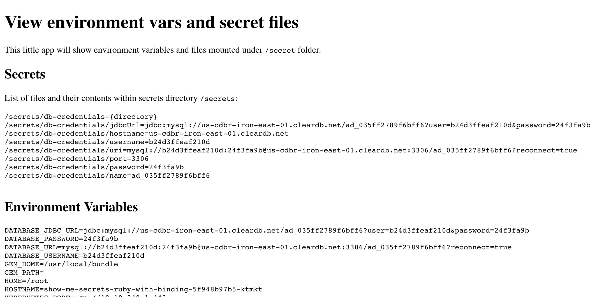

# Displays environment variables and /secrets folders

The primary purpose of this application was to show how a service instance from Service Catalog could appear as both a set of environment variables or files on the file system.



To deploy the sample Ruby/Sinatra application with a service instance/binding from your Service Catalog:

```shell
helm plugin install https://github.com/hypnoglow/helm-s3.git
helm repo add starkandwayne s3://helm.starkandwayne.com/charts
helm repo update

helm upgrade --install show-me-secrets starkandwayne/show-me-secrets \
    --set "database.service.class=cleardb,database.service.plan=spark"
```

In the example above, it is assumed that your Service Catalog has a service class "cleardb" with a service plan "spark".

To run the app without a database service instnace/binding:

```shell
helm upgrade --install show-me-secrets starkandwayne/show-me-secrets \
    --set "database.service.class=null"
```

To view the app via port forwarding:

```shell
export POD_NAME=$(kubectl get pods --namespace default -l "app.kubernetes.io/name=ruby-with-binding,app.kubernetes.io/instance=show-me-secrets" -o jsonpath="{.items[0].metadata.name}")
echo "Visit http://127.0.0.1:3000 to use your application"
kubectl port-forward $POD_NAME 3000:8080
```

As it says, visit http://127.0.0.1:3000 to use your application.

## Clean up

To remove the sample application:

```shell
helm delete --purge show-me-secrets
```